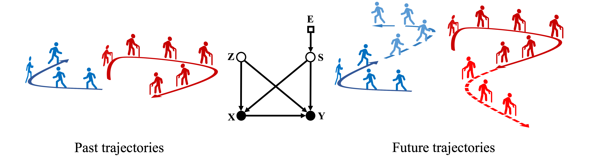
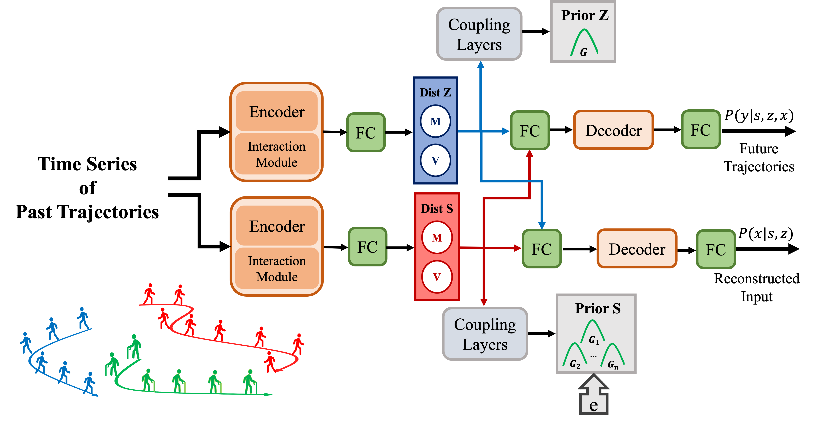
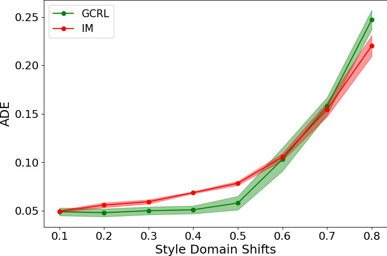
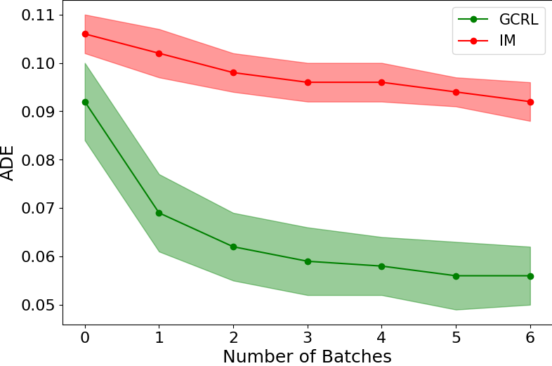

# [Generative Causal Representation Learning (ICML 2023 Paper)](https://proceedings.mlr.press/v202/shirahmad-gale-bagi23a.html)

We propose Generative Causal Representation Learning (GCRL) to address the
robustness and explainability of Deep learning models based on statistical inference
under domain shifts. Our down stream task is motion forecasting which is a challenging
problem in the context of autonomous vehicles, however,
GCRL can be applied in other domains as well. 

GCRL improves the *robustness* and *efficiency* of deep learning models for knowledge transfer via:
* incorporating sparse mechanism shift principle in causal models
* Learning representations that are common across domains (invariant) 
* Learning representations that are specific to each domain (variant) 

--- 

## Structural Causal Model

We propose a novel augmented structural causal model to learn representations in motion forecasting 
which improves the efficiency of models in knowledge transfer. In our causal model, changes in each
domain tend to manifest themselves in the prior of variant features S.



--- 

## Representation Learning

We learn the invariant representations Z, variant representations S, and the causal mechanisms that generate
the observed trajectories X and future trajectories Y using variational inference in end-to-end manner. Our method can be incorporated into 
the existing motion forecasting models that have an encoder, an interaction module, and a decoder. 



--- 

### Requirements

```
pip install --upgrade pip
pip install -r requirements.txt
pip3 install torch torchvision torchaudio

```

---

---

### Dataset

Synthetic dataset can be downloaded from [here](https://github.com/vita-epfl/causalmotion). All datasets should be saved in `/datasets/{dataset_name}`. 

--- 

### Training

Train GRCL on ETH-UCY dataset for robustness experiment.
```
bash scripts/train_eth_ucy.sh
```
Train GRCL on ETH-UCY dataset for different environments.
```
bash scripts/train_eth_ucy_envs.sh
```
Train GRCL on synthetic dataset for domain adaptation experiments.
```
bash scripts/train_synthetic.sh
```

Pretrained models on `syntheic` dataset with seed=1,2,3,4,5 are already saved in `/models/v4/pretrain/`.
Pretrained model for `eth` environment is already saved in `/models/eth/pretrain/`.

### Zero-shot Generalization

Evaluate pretrained models on `synthetic` dataset for different domains, including both in-distribution and out-of-distribution settings and `eth` environment.
```
bash scripts/evaluate_generalization.sh
```

Save all the quantitative results in `results/{dataset_name}/pretrain/summary.csv` and plot the performances (i.e. ADE, FDE) as a function of different domain shifts.
```
bash scripts/extract_generalization.sh
```

Evaluate pretrained models on `synthetic` dataset for different number of generated future trajectories per sample.
```
bash scripts/evaluate_generative.sh
```
Save all the quantitative results in `results/{dataset_name}/pretrainN/summary.csv` and plot the performances (i.e. ADE, FDE) as a function of number of generated trajectories.
```
bash scripts/extract_generative.sh
```

--- 

### Identifiability

Calculate Mean Correlation Coefficient (MCC) of learnt latent spaces with seed=1,2,3,4,5 in  `synthetic` dataset and print MCC.
```
bash scripts/evaluate_identifiability.sh
```

--- 

### Low-shot Adaptation

Adapt pretrained model to new domains in the low-shot setting.
```
bash scripts/finetune.sh
```

Finetuned models on `synthetic` dataset with seed=1,2,3,4,5 are already saved in `/models/v4/finetune/`.

Evaluate finetuned models.
```
bash scripts/evaluate_adaptation.sh
```

Save all the quantitative results in `results/{dataset_name}/finetune/summary.csv` and plot the performances (i.e. ADE, FDE) as a function of number of batches at test time.
```
bash scripts/extract_adaptation.sh
```

---

### Basic Results

- **Out of Distribution Generalization**




Quantitative comparison of different methods under domain shifts. 
Models are evaluated by ADE (lower is better) over 5 seeds. 
GCRL is robust to domain shifts with in-distribution setting while the state-of-the-art method, IM, is sensitive to domain shifts. 
For out-of-distribution settings, both GCRL and IM are sensitive to domain shifts and require adaptation.

- **Low-Shot Transfer**



Quantitative results of different methods for transfer learning to a new domain, given limited batch of samples.
GCRL significantly boosts the efficiency of motion forecasting models compared to IM as it incorporates the sparse mechanisms shifts to manifest the changes
in each domain in the prior of S. Furthermore, GCRL uses a generative approach which can tackle the
multi-modality of trajectories. 

### Acknowledgements

Our code was developed on top of the public code of following papers:
* [Human Trajectory Prediction via Counterfactual Analysis, ICCV'21](https://github.com/CHENGY12/CausalHTP)
* [It Is Not the Journey but the Destination: Endpoint Conditioned Trajectory Prediction, ECCV'20](https://github.com/HarshayuGirase/Human-Path-Prediction)
* [STGAT: Modeling Spatial-Temporal Interactions for Human Trajectory Prediction, ICCV'19](https://github.com/huang-xx/STGAT)
* [Towards Robust and Adaptive Motion Forecasting: A Causal Representation Perspective , CVPR'2022](https://github.com/vita-epfl/causalmotion)
